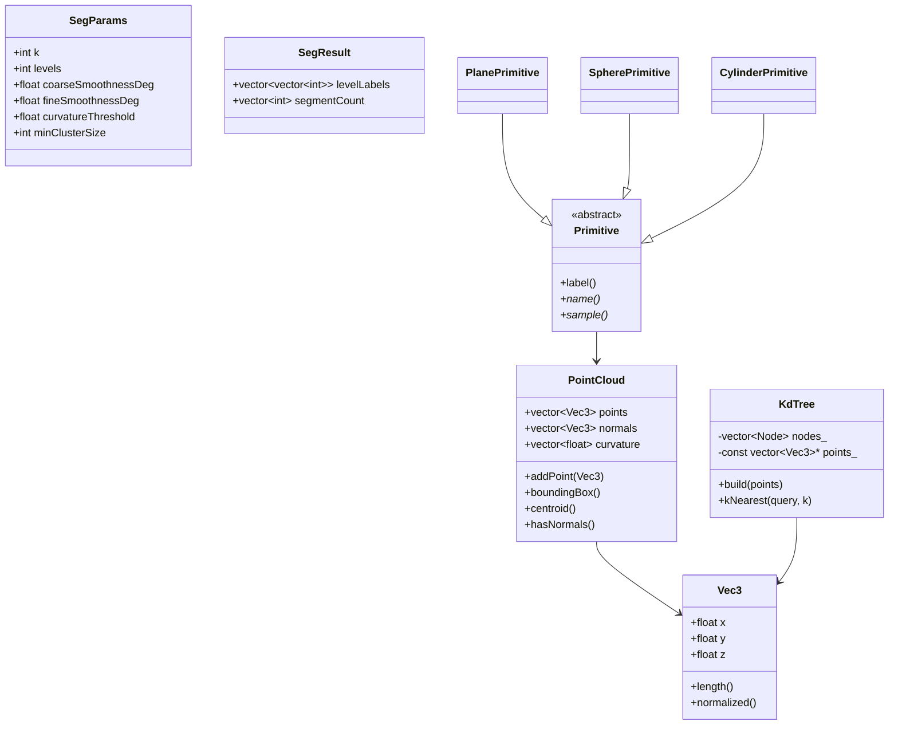

# PointCloudSegmentation 从零复刻指南（面向对象基础版）

这份文档的目标不是让你“会介绍这个项目”，而是让你理解到：把现有项目删掉之后，仍然知道应该按什么顺序、用哪些类、写哪些函数，把它重新做出来。

你只需要已有的面向对象程序设计基础：类、对象、构造函数、成员变量、成员函数、继承、虚函数、多态、`vector`、简单文件读写、递归、队列。

---

## 1. 这个项目到底在做什么

一句话：

> 输入一堆三维点，判断哪些点属于同一个物体或同一片表面，然后给不同片段染不同颜色。

点云就是很多个点：

```text
(x1, y1, z1)
(x2, y2, z2)
(x3, y3, z3)
...
```

程序要做的事：

```text
读取点云
  -> 建 KD 树，方便快速找附近点
  -> 对每个点估计法向量和曲率
  -> 用区域生长算法分割点云
  -> 给每个片段上色
  -> CLI 导出结果 / GUI 显示结果
```

如果你把点云想成“由很多小沙粒铺成的物体表面”，那么：

- 点的位置告诉你“沙粒在哪里”。
- 法向量告诉你“这个位置的表面朝哪个方向”。
- 曲率告诉你“这个位置平不平”。
- 区域生长就是“从一个平坦点出发，把附近朝向差不多的点合成一片”。

---

## 2. 最重要的设计思想：先做核心库，再做外壳

项目分成三层：

```text
core/       核心算法库：点云、KD树、法向量、分割、读写文件
apps/cli/   命令行程序：把核心算法串起来跑一遍
apps/gui/   图形界面：用按钮和 OpenGL 显示核心算法的结果
tests/      单元测试：检查核心算法是否正确
```

真正的项目灵魂在 `core`。如果你要从零复刻，顺序应该是：

```text
Vec3
  -> PointCloud
  -> PointCloudIO
  -> KdTree
  -> Normals
  -> Segmentation
  -> Synthetic
  -> tests
  -> CLI
  -> GUI
```

不要一上来写 GUI。GUI 只是最后的展示层。

---

## 3. 总体类和模块关系

可以把它理解成下面这张图：



注意：核心分割算法没有写成一个“大上帝类”。它拆成了很多小职责：

- `Vec3`：表示三维向量。
- `PointCloud`：保存点云数据。
- `KdTree`：负责快速找近邻。
- `estimateNormals`：负责估计法向量和曲率。
- `segment`：负责分割。
- `Primitive` 及其子类：负责生成演示点云。
- `PointCloudIO`：负责读写文件。

这就是面向对象里的“单一职责”。

---

## 4. 第一块：Vec3，所有几何计算的砖头

`Vec3` 表示三维向量或三维点。

为什么点和向量都用它？

因为在代码里，点和向量的存储形式一样，都是：

```cpp
float x, y, z;
```

你需要支持这些操作：

```cpp
Vec3 a(1, 2, 3);
Vec3 b(4, 5, 6);

a + b;       // 两个向量相加
a - b;       // 两点相减得到方向
a * 2.0f;    // 缩放
a / 2.0f;
a.length();  // 长度
a.normalized(); // 单位向量
dot(a, b);   // 点积
cross(a, b); // 叉积
```

点积 `dot(a, b)` 在本项目中尤其重要。两个单位法向量的点积可以判断夹角：

```text
dot 越接近 1，方向越一致
dot 越接近 0，方向越垂直
```

区域生长时，就是用它判断两个点是否属于同一个光滑表面。

复刻建议：

1. 先写 `Vec3`。
2. 写 `operator+ - * /`。
3. 写 `lengthSquared()`、`length()`、`normalized()`。
4. 写 `dot()`、`cross()`、`distanceSquared()`。
5. 写测试确认长度、点积、叉积正确。

---

## 5. 第二块：PointCloud，点云数据的容器

`PointCloud` 是整个程序最核心的数据结构。

它保存三类数据：

```cpp
vector<Vec3> points;      // 点坐标
vector<Vec3> normals;     // 每个点的法向量
vector<float> curvature;  // 每个点的曲率
```

一开始只有 `points` 有数据。调用 `estimateNormals()` 后，`normals` 和 `curvature` 才会被填上。

为什么不把法向量和曲率分散到每个点对象里？

可以这么设计，但当前项目选择了更简单的结构：

```text
points[i]    第 i 个点的位置
normals[i]   第 i 个点的法向量
curvature[i] 第 i 个点的曲率
```

这样数组下标永远对应同一个点，算法写起来直接。

`PointCloud` 需要提供：

- `size()`：点数。
- `empty()`：是否为空。
- `clear()`：清空点云。
- `addPoint()`：加入一个点。
- `hasNormals()`：是否已经有法向量。
- `boundingBox()`：求包围盒，GUI 相机需要。
- `centroid()`：求质心。

复刻时先不要想复杂，`PointCloud` 本质就是一个“带工具函数的数据盒子”。

---

## 6. 第三块：PointCloudIO，读写点云文件

程序支持两类输入：

```text
.xyz / .txt：每行 x y z
.ply：点云常见格式，支持 ascii 和 binary_little_endian
```

最简单的复刻路线：

第一阶段只支持 `.xyz`：

```text
打开文件
逐行读取
如果这一行能读出 x y z
就 cloud.addPoint(Vec3(x, y, z))
```

第二阶段再支持 `.ply`。

PLY 文件分两部分：

```text
头部 header：
  说明有多少个 vertex
  每个 vertex 有哪些属性，比如 x/y/z/red/green/blue

数据 body：
  真正的点坐标
```

保存彩色 PLY 时，写出：

```text
ply
format ascii 1.0
element vertex 点数
property float x
property float y
property float z
property uchar red
property uchar green
property uchar blue
end_header
x y z r g b
x y z r g b
...
```

读写模块不应该负责分割。它只负责把文件和 `PointCloud` 互相转换。

---

## 7. 第四块：KdTree，为什么需要它

法向量估计和区域生长都需要频繁做一件事：

> 给定一个点，找到离它最近的 k 个点。

最笨的方法：

```text
对每个点 i：
  扫描所有点 j
  计算距离
  排序
  取最近 k 个
```

如果有 N 个点，这会很慢。

KD 树的想法：

```text
把三维空间不断切成两半：
第 0 层按 x 切
第 1 层按 y 切
第 2 层按 z 切
第 3 层又按 x 切
...
```

每个 KD 树节点保存：

```cpp
struct Node {
    int pointIndex; // 这个节点代表哪个点
    int axis;       // 这一层按 x/y/z 哪个轴切
    int left;       // 左子树
    int right;      // 右子树
};
```

### 7.1 建树怎么做

递归建树：

```text
buildRecursive(indices, first, last, depth):
  如果区间为空，返回 -1

  axis = depth % 3
  mid = 区间中间

  按 axis 坐标，把中位数点放到 mid
  当前节点 = indices[mid]

  左子树 = buildRecursive(first, mid, depth + 1)
  右子树 = buildRecursive(mid + 1, last, depth + 1)
```

为什么取中位数？

为了让树尽量平衡，避免一边特别深。

### 7.2 查 k 近邻怎么做

核心思路：

```text
从根节点开始：
  先访问当前点，尝试加入“当前最近 k 个点”
  根据查询点在切分面的哪边，先搜更可能近的一侧
  再判断另一侧有没有必要搜
```

“当前最近 k 个点”用最大堆保存：

```text
堆里最多放 k 个候选点
堆顶是当前这 k 个里面最远的点
如果来了一个更近的点，就把堆顶替换掉
```

如果你刚开始复刻，完全可以先写暴力 kNN。等分割流程跑通后，再把暴力 kNN 换成 KD 树。

推荐顺序：

```text
先写 bruteForceKNearest()
  -> 跑通法向量和分割
  -> 再写 KdTree
  -> 用测试比较 KD 树结果和暴力结果是否一致
```

---

## 8. 第五块：法向量和曲率估计

### 8.1 法向量是什么

法向量就是表面的朝向。

比如地面 `z = 0`，它的法向量大概是：

```text
(0, 0, 1)
```

墙面如果是 `x = 2`，它的法向量大概是：

```text
(1, 0, 0)
```

如果两个点附近的法向量差不多，说明它们很可能在同一片平滑表面上。

### 8.2 怎么从点云估计法向量

对每个点：

```text
1. 找到它附近的 k 个点
2. 求这些邻居点的平均位置 mean
3. 看这些点相对 mean 是怎么分布的
4. 找到这个小邻域最“薄”的方向
5. 这个最薄方向就是法向量
```

为什么“最薄方向”是法向量？

想象一片桌面上的点。点主要沿桌面左右前后展开，但在垂直桌面的方向几乎没有厚度。所以最不分散的方向，就是垂直桌面的方向。

程序里用的是 PCA，本质就是：

```text
邻域点 -> 协方差矩阵 -> 特征值/特征向量
```

你只需要记住：

```text
最小特征值对应的特征向量 = 法向量
曲率 = 最小特征值 / 三个特征值之和
```

曲率越小，表示局部越平坦。

### 8.3 复刻 estimateNormals()

伪代码：

```text
estimateNormals(cloud, tree, k):
  cloud.normals.resize(n)
  cloud.curvature.resize(n)

  对每个点 i：
    nb = tree.kNearest(points[i], k)
    如果邻居少于 3：
      normal = (0,0,1)
      curvature = 0
      continue

    mean = 邻居点平均值

    计算协方差矩阵：
      c00 c01 c02
      c01 c11 c12
      c02 c12 c22

    eigen = symmetricEigen(c00,c01,c02,c11,c12,c22)

    normal = eigen.vectors[0]
    curvature = eigen.values[0] / sum(eigen.values)

    如果 normal.z < 0，把 normal 反向
    保存 normal.normalized()
```

`symmetricEigen()` 是数学工具函数。你复刻时有两条路：

- 简单路线：先借助 Eigen 库做特征值分解。
- 当前项目路线：自己实现 3x3 对称矩阵 Jacobi 迭代。

如果课程要求更看重 OOP 和整体设计，不必一开始死磕 Jacobi。你可以先把它当成“数学黑盒”：输入协方差矩阵，输出特征值和特征向量。

---

## 9. 第六块：区域生长分割

这是项目的主算法。

### 9.1 分割参数

`SegParams` 保存算法参数：

```cpp
int k;                        // 每个点看多少个邻居
int minClusterSize;           // 太小的片段当噪声
float curvatureThreshold;     // 多平坦的点才能继续扩张
int levels;                   // 由粗到细分几层
float coarseSmoothnessDeg;    // 粗分割角度阈值
float fineSmoothnessDeg;      // 细分割角度阈值
```

角度阈值越大，越容易把点合在一起；角度阈值越小，分得越细。

例如：

```text
30°：比较宽松，粗分割
10°：比较严格，细分割
```

### 9.2 分割结果

`SegResult` 保存每一层的标签：

```cpp
levelLabels[L][i]
```

含义：

```text
第 L 层中，第 i 个点属于哪个片段
```

例如：

```text
levelLabels[0][100] = 2
```

表示第 0 层分割里，第 100 个点属于 2 号片段。

`-1` 表示噪声或未分配。

### 9.3 为什么先建邻接表

区域生长需要知道“点 i 的邻居有哪些”。

所以先做：

```text
adjacency[i] = 点 i 的 k 个近邻
```

这样后面 BFS 扩张时直接查 `adjacency[cur]`。

### 9.4 一次区域生长 regionGrow()

输入：

- 点云。
- 邻接表。
- `allowed`：哪些点允许参与这次分割。
- 法向夹角阈值。
- 曲率阈值。
- 最小片段大小。

输出：

- 每个点的标签。

伪代码：

```text
regionGrow():
  labels 全部初始化为 -1

  order = 所有 allowed 点
  按 curvature 从小到大排序

  segId = 0
  对每个 seed in order:
    如果 seed 已经有标签，跳过

    新建队列 q
    seed 标为 segId
    seed 入队

    while q 不空:
      cur = q.front()
      q.pop()

      对 cur 的每个邻居 nb:
        如果 nb 不允许参与，跳过
        如果 nb 已经有标签，跳过

        c = abs(dot(normal[cur], normal[nb]))
        如果 c 小于 cos(角度阈值)：
          说明夹角太大，跳过

        nb 标为 segId

        如果 nb 的曲率足够小：
          nb 入队，继续向外扩张

    segId++

  删除太小的片段
  重新编号为 0,1,2...
```

这里有两个判断很关键：

```text
1. 法向量夹角小不小：
   决定能不能加入同一片。

2. 曲率够不够小：
   决定这个点能不能继续向外扩张。
```

为什么不是所有加入的点都继续扩张？

因为棱边附近的点可能刚好被并入当前片段，但如果让它继续扩张，就可能跨过边界，把另一面也吞进来。曲率阈值就是为了“在边界附近刹车”。

### 9.5 由粗到细 segment()

完整分割不是只跑一次，而是分层跑：

```text
第 0 层：
  所有点一起参与
  用 coarseSmoothnessDeg，比如 30°
  得到几个大块

第 1 层：
  在第 0 层每个大块内部单独细分
  阈值变小

第 2 层：
  在第 1 层每个片段内部继续细分
  阈值接近 fineSmoothnessDeg，比如 10°
```

伪代码：

```text
segment():
  adjacency = buildKnnAdjacency()

  labels0 = regionGrow(所有点, coarseAngle)
  保存第 0 层

  for L = 1 到 levels-1:
    angle = 从 coarse 线性变到 fine
    prev = 上一层标签

    对上一层每个片段 p：
      allowed = 只有 prev[i] == p 的点允许参与
      sub = regionGrow(allowed, angle)
      把局部 sub 标签转换成全局标签

    保存第 L 层
```

由粗到细的核心不是神秘算法，而是：

> 后一层只在前一层的每个片段内部继续分割，并且阈值更严格。

---

## 10. 第七块：Primitive，项目里最标准的继承和多态

为了测试和演示，项目能自己生成点云：

- 平面。
- 球。
- 圆柱。
- 斜面。

这些几何体都有共同点：

```text
都能在自己的表面采样点
都有一个标签
都有名字
```

所以设计一个抽象基类：

```cpp
class Primitive {
public:
    virtual string name() const = 0;
    virtual void sample(...) const = 0;
};
```

然后派生类：

```cpp
class PlanePrimitive : public Primitive
class SpherePrimitive : public Primitive
class CylinderPrimitive : public Primitive
```

### 10.1 为什么这是多态

代码里可以写：

```cpp
vector<unique_ptr<Primitive>> prims;
prims.push_back(make_unique<PlanePrimitive>(...));
prims.push_back(make_unique<SpherePrimitive>(...));
prims.push_back(make_unique<CylinderPrimitive>(...));

for (const auto& p : prims) {
    p->sample(...);
}
```

`p` 的静态类型是 `Primitive*`，但运行时它可能指向平面、球或圆柱。

调用 `p->sample()` 时：

- 如果实际对象是平面，就调用 `PlanePrimitive::sample()`。
- 如果实际对象是球，就调用 `SpherePrimitive::sample()`。
- 如果实际对象是圆柱，就调用 `CylinderPrimitive::sample()`。

这就是运行时多态。

### 10.2 为什么这样设计好

如果以后要新增一个圆锥：

```cpp
class ConePrimitive : public Primitive {
    void sample(...) const override;
};
```

然后在 `makeScene()` 里加一行：

```cpp
prims.push_back(make_unique<ConePrimitive>(...));
```

主循环不用改：

```cpp
for (const auto& p : prims) p->sample(...);
```

这就是“对扩展开放，对修改关闭”的味道。

---

## 11. 第八块：Synthetic，生成演示数据

`Synthetic` 模块有两个函数：

```cpp
makeTwoPlanes()
makeScene()
```

`makeTwoPlanes()` 用于测试：

```text
平面 A：z = 0
平面 B：x = 2
两个平面朝向差 90°
正确结果应该分成 2 段
```

`makeScene()` 用于演示：

```text
地面 + 球 + 圆柱 + 斜面
```

它返回 `LabeledCloud`：

```cpp
struct LabeledCloud {
    PointCloud cloud;
    vector<int> labels;
    int numClasses;
};
```

`labels[i]` 是第 i 个点真实属于哪个几何体。这在测试里很有用，因为可以比较算法分割结果和真值是否大致一致。

---

## 12. 第九块：CLI，把完整流程串起来

命令行程序 `pcseg_cli` 做的事非常直白：

```text
解析参数
准备点云：读文件或生成 demo
建 KD 树
估计法向量
分割
打印每层段数
按标签上色
保存 PLY
```

它对应代码流程：

```cpp
PointCloud cloud;

// 1. 准备点云
if (useDemo) {
    LabeledCloud lc = makeScene();
    cloud = lc.cloud;
} else {
    loadPointCloud(inputPath, cloud, err);
}

// 2. 建 KD 树 + 法向量
KdTree tree;
tree.build(cloud.points);
estimateNormals(cloud, tree, params.k);

// 3. 分割
SegResult result = segment(cloud, tree, params);

// 4. 导出颜色
for each point:
    color = colorForLabel(label)
savePLYColored(...)
```

复刻时，CLI 是你最早应该做出来的可运行程序。只要 CLI 能跑通，说明核心算法链条已经通了。

---

## 13. 第十块：GUI，只是把核心库可视化

GUI 不是核心算法。它主要有两个类：

```text
Viewer：管理点云、分割结果、OpenGL 缓冲、渲染和 UI
Camera：管理观察视角
```

`Viewer` 内部持有：

```cpp
PointCloud cloud_;
KdTree tree_;
SegResult seg_;
SegParams params_;
Camera camera_;
```

按钮“运行分割”本质上就是调用：

```cpp
estimateNormals(cloud_, tree_, params_.k);
seg_ = segment(cloud_, tree_, params_);
updateColors();
```

GUI 的颜色模式：

- `Segment`：按分割标签上色。
- `Normal`：按法向量方向上色。
- `Height`：按高度上色。
- `Flat`：统一颜色。

所以你可以最后再做 GUI。答辩时如果老师问“界面和算法怎么分离”，可以说：

> 核心算法都在 `pcseg_core` 静态库中，GUI 只是调用核心库得到结果，再把点坐标和颜色上传到 OpenGL 显示。

---

## 14. 复刻路线：按 10 个阶段做

### 阶段 1：搭项目骨架

目录：

```text
core/include/pcseg/
core/src/
apps/cli/
tests/
CMakeLists.txt
```

先让 CMake 能编译一个空程序。

### 阶段 2：写 Vec3

完成：

- `Vec3`
- `dot`
- `cross`
- `distanceSquared`

测试：

- `(1,2,2)` 长度是 3。
- `dot((1,2,2),(0,0,1))` 是 2。
- `cross((1,0,0),(0,1,0))` 是 `(0,0,1)`。

### 阶段 3：写 PointCloud

完成：

- `points`
- `normals`
- `curvature`
- `addPoint`
- `boundingBox`
- `centroid`

测试：

- 加 3 个点，`size()` 正确。
- 包围盒最小最大值正确。

### 阶段 4：写文件读写

先只写 `.xyz`：

```text
每行 x y z
```

再写保存彩色 `.ply`。

测试：

- 写出几个点。
- 再读回来。
- 坐标一致。

### 阶段 5：先写暴力 kNN

不要一上来写 KD 树。

先写：

```text
输入 query 和 k
遍历所有点算距离
排序
返回前 k 个下标
```

这样你能先跑通后面的法向量。

### 阶段 6：写法向量估计

完成：

- 找近邻。
- 求平均点。
- 求协方差矩阵。
- 求最小特征值对应特征向量。
- 保存法向量和曲率。

测试：

```text
生成 z=0 平面上的点
估计中间点法向量
它应该接近 (0,0,1)
曲率应该很小
```

### 阶段 7：写区域生长

先写单层 `regionGrow()`。

测试：

```text
两个互相垂直且分开的平面
应该分成 2 段
```

### 阶段 8：写由粗到细 segment()

完成多层：

```text
第 0 层全局粗分割
后续每层在上一层内部细分
```

测试：

```text
段数应该不减少：
L1 >= L0
L2 >= L1
```

### 阶段 9：写 Primitive 和 Synthetic

完成：

- `Primitive` 抽象基类。
- `PlanePrimitive`
- `SpherePrimitive`
- `CylinderPrimitive`
- `makeTwoPlanes`
- `makeScene`

测试多态：

```cpp
vector<unique_ptr<Primitive>> prims;
for (const auto& p : prims) p->sample(...);
```

确认不同派生类的 `sample()` 都被正确调用。

### 阶段 10：写 CLI，再考虑 GUI

CLI 跑通：

```bash
./pcseg_cli --demo -o segmented.ply
```

能输出彩色 PLY 后，再补 GUI。

---

## 15. 如果要答辩，应该怎么讲设计

可以按这个顺序讲：

1. 项目目标：对 3D 点云做由粗到细的目标分割。
2. 数据抽象：用 `Vec3` 表示点和向量，用 `PointCloud` 管理点云及其法向量、曲率。
3. 算法支撑：用 `KdTree` 加速 k 近邻查询。
4. 局部几何：用 PCA 估计每个点的法向量和曲率。
5. 分割算法：用区域生长，根据法向夹角和曲率判断是否属于同一片。
6. 由粗到细：逐层收紧角度阈值，并在上一层片段内部继续细分。
7. 面向对象设计：用 `Primitive` 抽象基类和派生类生成不同几何体，体现继承与多态。
8. 分层架构：核心库与 CLI、GUI 分离，方便测试和复用。
9. 测试验证：用两平面、演示场景、KD 树对比暴力解等测试保证正确性。

---

## 16. 你必须真正理解的 8 个问题

如果下面问题你都能自己答出来，基本就能重写项目：

1. 为什么 `PointCloud` 里 `points[i]`、`normals[i]`、`curvature[i]` 要用同一个下标对应同一个点？
2. 为什么估计法向量前要找 k 近邻？
3. 为什么平面点云的最小特征值方向是法向量？
4. 曲率为什么能判断一个点附近平不平？
5. 区域生长为什么先从曲率小的点开始？
6. 为什么法向夹角小的邻居可以并入同一段？
7. 为什么曲率大的点可以加入片段，但不应该继续扩张？
8. `Primitive*` 指向不同派生类时，为什么调用 `sample()` 会执行不同代码？

---

## 17. 最小可运行版本应该长什么样

如果你时间不够，最小版本可以不做 GUI、不做二进制 PLY、不做 KD 树优化。

最小版本：

```text
Vec3
PointCloud
读取 xyz
暴力 kNN
estimateNormals
regionGrow
segment
保存彩色 ascii PLY
CLI
```

这个版本虽然慢一点，但思想完整。

然后增强：

```text
暴力 kNN -> KD 树
xyz -> PLY
单层分割 -> 多层由粗到细
CLI -> GUI
```

---

## 18. 一句话记住整个项目

> 这个项目用面向对象把点云数据、近邻查询、法向量估计、区域生长分割、演示数据生成和可视化分层组织起来；核心算法先根据邻域估计每个点的表面朝向和曲率，再从平坦点出发，把附近法向一致的点逐步合并，并通过逐层收紧阈值实现由粗到细的分割。

---

## 19. 推荐源码阅读顺序

如果你直接从 `main.cpp` 开始看，容易被参数解析和界面代码干扰。建议按下面顺序读。

### 19.1 第一轮：只看接口，知道有哪些“零件”

先读头文件：

```text
core/include/pcseg/Vec3.h
core/include/pcseg/PointCloud.h
core/include/pcseg/KdTree.h
core/include/pcseg/Normals.h
core/include/pcseg/Segmentation.h
core/include/pcseg/Primitive.h
core/include/pcseg/Synthetic.h
core/include/pcseg/PointCloudIO.h
```

这一轮不要纠结函数内部怎么实现，只回答三个问题：

```text
这个类/函数负责什么？
它需要什么输入？
它给别人什么输出？
```

### 19.2 第二轮：看核心算法实现

按这个顺序读：

```text
core/src/PointCloud.cpp
core/src/KdTree.cpp
core/src/Normals.cpp
core/src/Segmentation.cpp
```

对应关系：

```text
PointCloud.cpp     数据工具函数
KdTree.cpp         快速近邻查询
Normals.cpp        法向量和曲率
Segmentation.cpp   区域生长和由粗到细
```

读 `Segmentation.cpp` 时，把自己代入成算法：

```text
我现在站在 seed 点上
我查看它的邻居
邻居法向量差不多，就加入
邻居足够平坦，就继续从它往外走
```

### 19.3 第三轮：看多态和测试数据

读：

```text
core/include/pcseg/Primitive.h
core/src/Primitive.cpp
core/src/Synthetic.cpp
```

重点看：

```text
Primitive 为什么要有 virtual sample()
Plane/Sphere/Cylinder 的 sample() 各自怎么生成点
makeScene() 为什么可以用 vector<unique_ptr<Primitive>> 统一管理不同形状
```

### 19.4 第四轮：看程序入口

读：

```text
apps/cli/main.cpp
```

你要能把它读成这一句话：

```text
准备点云 -> 建树 -> 算法向量 -> 分割 -> 上色 -> 保存
```

如果这一句话能对应到代码里的每一段，说明你已经理解主流程了。

### 19.5 第五轮：看测试

读：

```text
tests/test_main.cpp
```

测试是“重写项目时的验收标准”。你每重写一块，就应该写一个小测试：

```text
Vec3 算对了吗？
KD 树近邻和暴力结果一致吗？
平面法向量接近 (0,0,1) 吗？
两个垂直平面能分成 2 段吗？
演示场景由粗到细时段数不减少吗？
Primitive 多态调用对吗？
```

### 19.6 第六轮：最后看 GUI

读：

```text
apps/gui/Viewer.h
apps/gui/ViewerPanel.cpp
apps/gui/Viewer.cpp
apps/gui/Camera.h
```

GUI 的阅读目标不是成为 OpenGL 专家，而是看懂：

```text
Viewer 里保存了核心数据
按钮会调用 runSegmentation()
runSegmentation() 又调用 estimateNormals() 和 segment()
updateColors() 把分割标签变成颜色
render() 把点画到屏幕上
```

---

## 20. 复刻时最容易卡住的地方

### 20.1 法向量方向可能正反不一致

一个平面的法向量 `(0,0,1)` 和 `(0,0,-1)` 都是对的，因为它们都垂直于平面。

所以分割时比较法向量夹角用了：

```cpp
fabs(dot(n1, n2))
```

这样正向和反向都认为一致。

### 20.2 k 太小，法向量不稳定

估计一个局部平面至少需要 3 个点，但实际点云有噪声，所以通常用：

```text
k = 16
```

k 太小：法向量抖。

k 太大：跨过边界，法向量被混合。

### 20.3 minClusterSize 太大，会把小物体删掉

`minClusterSize` 用来过滤噪声。如果设太大，小片段会被标成 `-1`。

### 20.4 coarse/fine 角度要有层次

通常：

```text
coarseSmoothnessDeg > fineSmoothnessDeg
```

比如：

```text
coarse = 30
fine = 10
```

如果二者一样，就不是由粗到细，只是重复分割。

### 20.5 不要让 GUI 反过来污染核心算法

核心库不要包含 OpenGL、ImGui、窗口代码。

正确方向：

```text
GUI 调用 core
```

不要变成：

```text
core 依赖 GUI
```

这样测试和命令行都会变麻烦。
